# 🤖 AI-Hand-to-Text-2026 (Real-Time Sign Language & Hand Gesture Recognition)

<div align="center">

[](https://www.python.org/)
[](https://developers.google.com/mediapipe)
[](https://tensorflow.org/)
[](https://opencv.org/)
[](LICENSE)

**ระบบแปลงภาษามือและท่าทางของมือเป็นข้อความแบบเรียลไทม์ ด้วยเทคโนโลยี Computer Vision & Deep Learning**  
*ผสานพลัง Google MediaPipe Hand Landmarker (Tasks API) และ Keras Deep Neural Network สำหรับจำแนกท่าทางภาษามือ*

[🐛 แจ้งปัญหา (Report Bug)](https://github.com/PhuriphatTyPeZ3r0/AI-Hand-to-Text-2026/issues) · [✨ เสนอแนะฟีเจอร์ (Request Feature)](https://github.com/PhuriphatTyPeZ3r0/AI-Hand-to-Text-2026/issues)

</div>

---

## 📌 สารบัญ (Table of Contents)
- [📖 เกี่ยวกับโปรเจกต์ (About The Project)](#-เกี่ยวกับโปรเจกต์-about-the-project)
- [✨ ฟีเจอร์หลัก (Key Features)](#-ฟีเจอร์หลัก-key-features)
- [🎯 ท่าทางภาษามือที่รองรับ (Recognized Gestures)](#-ท่าทางภาษามือที่รองรับ-recognized-gestures)
- [🛠️ สถาปัตยกรรมและเทคโนโลยี (Tech Stack & Pipeline)](#️-สถาปัตยกรรมและเทคโนโลยี-tech-stack--pipeline)
- [📂 โครงสร้าง Repository (Directory Structure)](#-โครงสร้าง-repository-directory-structure)
- [🚀 การติดตั้งและเริ่มต้นใช้งาน (Getting Started)](#-การติดตั้งและเริ่มต้นใช้งาน-getting-started)
- [👨‍💻 ผู้พัฒนา (Author)](#-ผู้พัฒนา-author)

---

## 📖 เกี่ยวกับโปรเจกต์ (About The Project)

> **ที่มาและปัญหา (Problem Statement):**  
> ผู้ที่มีความบกพร่องทางการได้ยินและการพูดมักประสบอุปสรรคในการสื่อสารกับบุคคลทั่วไปที่ไม่ได้เรียนรู้ภาษามือ การสร้างสะพานเชื่อมต่อด้วยเทคโนโลยีปัญญาประดิษฐ์เชิงสายตา (Vision AI) จึงเป็นก้าวสำคัญในการส่งเสริมความเท่าเทียมในสังคม

**แนวทางการแก้ไข (Solution):**  
**AI-Hand-to-Text-2026** คือระบบตรวจจับและจำแนกท่าทางภาษามือจากกล้องเว็บแคมแบบ Real-Time:
1. ใช้ **Google MediaPipe Hand Landmarker** สกัดจุดพิกัดมือ (21 Hand Landmarks) พร้อมคำนวณ Dynamic Bounding Box ที่มี Margin ป้องกันการตกขอบ
2. ทำ Preprocessing และ Resizing รูปภาพของมือขนาด 224x224 พิกเซล
3. ส่งเข้าโมเดล **Deep Convolutional Neural Network (Keras / TensorFlow)** เพื่อทำนายผลลัพธ์ภาษามือพร้อมค่าความเชื่อมั่น (Confidence Score %) แบบเรียลไทม์ที่ ~30 FPS

---

## ✨ ฟีเจอร์หลัก (Key Features)

- [x] ⚡ **Real-Time Video Pipeline:** ประมวลผลภาพสดผ่าน Web Camera ที่อัตราความเร็ว ~30 FPS
- [x] 🖐️ **Precise Landmark Detection:** ตรวจจับตำแหน่งข้อนิ้วมือและพิกัด 21 จุด 3 มิติอย่างแม่นยำ
- [x] 📦 **Adaptive Bounding Box & Padding:** ตัดส่วนภาพมือเฉพาะจุดที่สนใจ (ROI) พร้อมคำนวณ Margin อัตโนมัติ
- [x] 🧠 **Deep Learning Inference:** พยากรณ์ท่าทางด้วยโมเดล Keras (.h5) พร้อมแสดง Confidence Score
- [x] 🖥️ **Live HUD Overlay:** พลอตกรอบ Bounding Box สีเขียวและแสดงข้อความผลลัพธ์บนจอภาพทันที

---

## 🎯 ท่าทางภาษามือที่รองรับ (Recognized Gestures)

| ลำดับ | ท่าทางภาษามือ (Gesture / Sign) | ความหมายและบริบทการสื่อสาร |
| :---: | :--- | :--- |
| 1 | ✋ **Hello** | การทักทาย / สวัสดี |
| 2 | 🤞 **Good Luck** | การอวยพร / ขอให้โชคดี |
| 3 | 🤟 **I Love You** | ฉันรักคุณ (สัญลักษณ์ภาษามือสากล) |
| 4 | 👍 **Yes** | ใช่ / ตกลง / เห็นชอบ |
| 5 | 👎 **No** | ไม่ / ปฏิเสธ |

---

## 🛠️ สถาปัตยกรรมและเทคโนโลยี (Tech Stack & Pipeline)

```mermaid
graph LR
    Webcam["📹 Webcam Video Stream"] --> Preprocess["⚙️ OpenCV (Color Conversion & Resizing)"]
    Preprocess --> MediaPipe["🖐️ MediaPipe Tasks (Hand Landmarker)"]
    MediaPipe --> BoundingBox["📐 Dynamic Bounding Box & Padding"]
    BoundingBox --> KerasModel["🧠 Keras CNN Model (224x224)"]
    KerasModel --> Prediction["📊 Softmax Probability & Argmax"]
    Prediction --> Display["🖥️ Real-time Display (Overlay Text & Score)"]
```



- **ภาษาหลัก:** Python 3.10+
- **Computer Vision Framework:** OpenCV (`cv2`)
- **Hand Tracking Engine:** Google MediaPipe Tasks API (`hand_landmarker.task`)
- **Deep Learning Framework:** TensorFlow / Keras (`tf_keras`)
- **Numerical Processing:** NumPy

---

## 📂 โครงสร้าง Repository (Directory Structure)

```text
AI-Hand-to-Text-2026/
├── converted_keras/
│   ├── keras_model.h5          # Trained Deep Neural Network Model weights
│   └── labels.txt              # Classification Labels (Hello, Good Luck, etc.)
├── hand_landmarker.task        # MediaPipe Pre-trained Hand Landmark Model
├── main.py                     # Core Real-time Vision Pipeline Application
└── README.md                   # Project Documentation
```

---

## 🚀 การติดตั้งและเริ่มต้นใช้งาน (Getting Started)

### ข้อกำหนดเบื้องต้น (Prerequisites)
- Python 3.10 หรือใหม่กว่า
- กล้องเว็บแคม (Webcam) ที่สามารถเชื่อมต่อได้

### ขั้นตอนการรัน
1. **โคลน Repository:**
   ```bash
   git clone https://github.com/PhuriphatTyPeZ3r0/AI-Hand-to-Text-2026.git
   cd AI-Hand-to-Text-2026
   ```

2. **สร้าง Virtual Environment และติดตั้ง Dependencies:**
   ```bash
   python -m venv venv
   source venv/bin/activate  # บน Windows: .\venv\Scripts\activate
   pip install opencv-python mediapipe tensorflow tf_keras numpy
   ```

3. **รันโปรแกรม:**
   ```bash
   python main.py
   ```
   *(กดคีย์ `q` เพื่อออกจากโปรแกรม)*

---

## 👨‍💻 ผู้พัฒนา (Author)

**Phuriphat Hemakul (PhuriphatTyPeZ3r0)**
- 🎓 นักศึกษา สาขาวิศวกรรมคอมพิวเตอร์และปัญญาประดิษฐ์ (PIM CAI)
- 🏛️ สถาบันการจัดการปัญญาภิวัฒน์ (PIM)
- 🐙 GitHub: [@PhuriphatTyPeZ3r0](https://github.com/PhuriphatTyPeZ3r0)
- 🌐 Portfolio: [portfolio-phuriphatizamus-projects.vercel.app](https://portfolio-phuriphatizamus-projects.vercel.app)